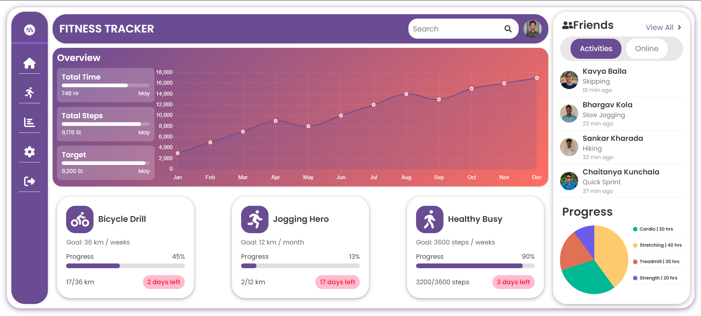

# Fitness Tracker Application

## Table of Contents

- [Introduction](#introduction)
- [Features](#features)
- [Screenshots](#screenshots)
- [Installation](#installation)
- [Usage](#usage)
- [Technologies](#technologies)
- [Folder Structure](#folder-structure)
- [License](#license)
- [Acknowledgements](#acknowledgements)

## Introduction

The Fitness Tracker Application is a React-based web application designed to help users monitor their fitness activities. It features an overview of their progress, activity cards, friends list, and more, making it easy to keep track of fitness goals and stay motivated.

## Features

- **Overview Section**: Displays total time, steps, and target achievements.
- **Activity Cards**: Show progress of various activities like biking, jogging, and walking.
- **Friends List**: Displays friends' recent activities and progress.
- **Header**: Includes a search bar and user profile picture.
- **Sidebar**: Navigation menu with icons for home, activities, statistics, settings, and logout.
- **Charts**: Visual representation of fitness data using line and doughnut charts.

## Screenshots



## Installation

1. Clone the repository:

    ```bash
    git clone https://github.com/minnukota381/Fitness-Tracking-App-UI-React.git
    ```

2. Navigate to the project directory:

    ```bash
    cd Fitness-Tracking-App-UI-React
    ```

3. Install the dependencies:

    ```bash
    npm install
    ```

4. Start the development server:

    ```bash
    npm start
    ```

## Usage

1. Open your browser and go to `http://localhost:3000` to see the application in action.
2. Use the sidebar to navigate through different sections of the application.
3. View your fitness progress, check your friends' activities, and manage your fitness goals.

## Technologies

- **React**: JavaScript library for building user interfaces.
- **Chart.js**: For creating interactive charts.
- **React-Icons**: For integrating icons in the UI.
- **CSS3**: For styling the application.

## Folder Structure

```plaintext
fitness-tracker/
│
├── public/
│   ├── index.html
│   └── ...
│
├── src/
│   ├── Assets/
│   │   ├── kavya.jpg
│   │   ├── bhargav.jpg
│   │   ├── sankar.jpg
│   │   ├── chaitu.jpg
│   │   └── minnu.JPG
│   ├── components/
│   │   ├── ActivityCards.js
│   │   ├── DonutChart.js
│   │   ├── FriendsList.js
│   │   ├── Header.js
│   │   ├── Overview.js
│   │   └── Sidebar.js
│   ├── styles/
│   │   ├── ActivityCards.css
│   │   ├── FriendsList.css
│   │   ├── Header.css
│   │   ├── Overview.css
│   │   └── Sidebar.css
│   ├── App.css
│   ├── App.js
│   └── index.js
│
└── package.json
```

## License

This project is licensed under the MIT License. See the [LICENSE](LICENSE) file for details.

## Acknowledgements

- Thanks to the open-source community for providing valuable libraries and tools.
